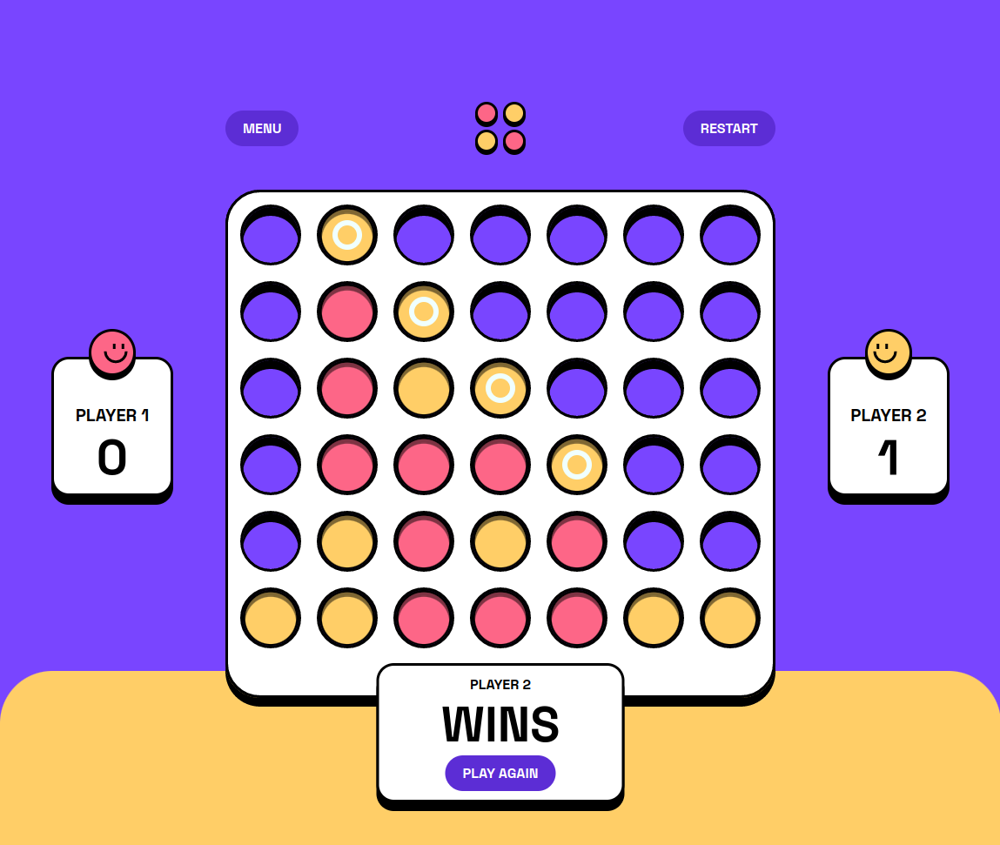

# Frontend Mentor - Connect Four game solution

This is a solution to the [Connect Four game challenge on Frontend Mentor](https://www.frontendmentor.io/challenges/connect-four-game-6G8QVH923s).

## Table of contents

- [Overview](#overview)
  - [The challenge](#the-challenge)
  - [Screenshot](#screenshot)
  - [Links](#links)
- [My process](#my-process)
  - [Built with](#built-with)
  - [Continued development](#continued-development)
- [Author](#author)

## Overview

### The challenge

Users should be able to:

- View the game rules
- Play a game of Connect Four against another human player (alternating turns on the same computer)
- View the optimal layout for the interface depending on their device's screen size
- See hover and focus states for all interactive elements on the page
- **Bonus**: See the discs animate into their position when a move is made
- **Bonus**: Play against the computer

### Screenshot

### Links

- [Solution](https://github.com/kxrn0/Connect-Four)
- [Live](https://kxrn0.github.io/Connect-Four/)

## My process

### Built with

- Semantic HTML5 markup
- CSS custom properties
- Flexbox
- CSS Grid
- [React](https://reactjs.org/) - JS library
- [Styled Components](https://styled-components.com/) - For styles
- [Vite PWA Plugin](https://vite-pwa-org.netlify.app/)

### Continued development

Currently the AI chooses cells randomly. A future update will have it choose the cells intelligently based on search algorithms.

## Author

- Github - [@Kxrn0](https://github.com/kxrn0)
- Frontend Mentor - [@kxrn0](https://www.frontendmentor.io/profile/kxrn0)
